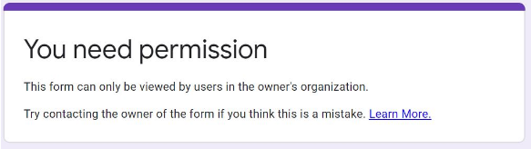

# Course FAQ - Intelligent Decision Making 2023

As any FAQ page, this page is always "under construction”. As we realize that some questions become common, we add them here…

- [Course FAQ - Intelligent Decision Making 2023](#course-faq---intelligent-decision-making-2023)
- [ADMINISTRATION](#administration)
  - [Why this FAQ?](#why-this-faq)
  - [Communication policy: I have a question, can I email you?](#communication-policy-i-have-a-question-can-i-email-you)
  - [Attendance: do I need to attend workshops?](#attendance-do-i-need-to-attend-workshops)
  - [What are the dates for this semester?](#what-are-the-dates-for-this-semester)
  - [Course Survey Experience: what? why?](#course-survey-experience-what-why)
    - [Some links on the topic](#some-links-on-the-topic)
  - [I have a question about the course, but it is not here!](#i-have-a-question-about-the-course-but-it-is-not-here)
- [COURSE GENERAL](#course-general)
  - [Is this course theoretical or practical?](#is-this-course-theoretical-or-practical)
  - [What programming languages are used?](#what-programming-languages-are-used)
  - [Are assignments individual or in groups?](#are-assignments-individual-or-in-groups)
  - [What is the overall difficulty of the topics?](#what-is-the-overall-difficulty-of-the-topics)
  - [What is the relation of this course with COSC1125/1127 Artificial Intelligence Course?](#what-is-the-relation-of-this-course-with-cosc11251127-artificial-intelligence-course)
- [DISCUSSION FORUM \& FORUM ETIQUETTE](#discussion-forum--forum-etiquette)
- [WORKSHOP](#workshop)
  - [Are attendance to the workshop mandatory?](#are-attendance-to-the-workshop-mandatory)
  - [But I cannot book my sessions, it says it is full; should I do?](#but-i-cannot-book-my-sessions-it-says-it-is-full-should-i-do)
  - [When are lecture slides made available?](#when-are-lecture-slides-made-available)
  - [When are lecture/workshop recordings available?](#when-are-lectureworkshop-recordings-available)
  - [So, when \& where are the workshops?](#so-when--where-are-the-workshops)
  - [I cannot attend my workshop session, can I change to another session?](#i-cannot-attend-my-workshop-session-can-i-change-to-another-session)
  - [Should I bring my laptop to the workshops?](#should-i-bring-my-laptop-to-the-workshops)
- [ASSESSMENTS](#assessments)
  - [I was never asked these questions!](#i-was-never-asked-these-questions)
  - [Can I ask questions on an assignment/assessment in the forum?](#can-i-ask-questions-on-an-assignmentassessment-in-the-forum)
  - [Academic Integrity? What is that?](#academic-integrity-what-is-that)
- [TECHNICAL](#technical)
  - [Cannot access the Google Form, says I need permission](#cannot-access-the-google-form-says-i-need-permission)
  - [Questions about GIT?](#questions-about-git)

# ADMINISTRATION

## Why this FAQ?

This is the list of usual questions that are asked about the course. A FAQ like this can help you find the answer right away. There are also many questions that can shed some light on the rationale of certain policies or approaches to the course. Also, by having an FAQ I am able to provide consistent and uniform answers to everyone. Of course, if you cannot find your question here, then you are invited to post it in the discussion forum. As questions become more common or usual, I add them to this list. So, maybe your new question can make it to the list! :-)

## Communication policy: I have a question, can I email you?

**Communication/email policy:** Except for personal issues, all electronic communication must be directed to the [EdStem Discussion Forum](https://edstem.org/au/courses/11583). I only use email for limited communications regarding **personal circumstances** (in which case email is just used to arrange a face-to-face meeting). In particular, I will not respond by e-mail to any requests to clarify lecture, tutorial, or assignment questions. Please use workshops and discussion forums for all such questions so that a _fair course is run_ and all other fellow students can benefit as well. Do not be afraid to post any question (of course, as long as it is a proper question: just asking for “help” or providing solutions/insights on assignments is not acceptable, as it may amount to plagiarism), no question is stupid! To benefit from others, then, please ensure that you _regularly check_ the course website and attend lectures and tutorials.

## Attendance: do I need to attend workshops?

**YES!** This is a research-oriented seminar-style advanced course, which means it requires on campus attendance to workshops.

Workshops are not lectures where the instructor delivers the content. Instead, we discuss together each week content at workshops, we do presentations, execute drills, etc. So, on campus personal presence is necessary. Also, a component of the assessment is assigned to _participation_ during workshops, presentation, and leadership. To participate actively will surely require being there. :-)

In addition, workshops will be the place to discuss your projects/assignments and doubts about them. The course will have a small set of students, which makes it a perfect environment for participation and sharing of knowledge, ideas, and opinions!  So, we strongly suggest attending ALL workshops in person. The discussions, exchanges, and support opportunities done in the workshop will not be duplicated elsewhere.

Note that there is only 1 workshop session of 3hrs, and late in the day.

## What are the dates for this semester?

Here is the [Academic Calendar for 2024](https://www.rmit.edu.au/students/my-course/important-dates/2024/he).

## Course Survey Experience: what? why?

The **usefulness of student course surveys** has been the subject of **much debate** in the academia and whether it is a useful tool to improve the quality of teaching or just a mechanism that leads _lower teaching standards_ (and _grade inflation_ ). If you want to read more about this debate, see the articles I posted at the bottom. 

The fact is that the Course Survey is **used to evaluate us, academic staff, in our teaching**. It is possibly the main evaluation source. The Course Survey gives, in the end, a_"Good Teaching Score" (GTS). The GTS ranges from 0 (bad) to 100 (excellent). The **average across Computer Science is around 78 (or 3.94 out of 5)**, with highest courses scoring between 90+ (or 4.5+ out of 5).

In the survey, each answer is a score between _1 (strongly disagree)_ an _5 (strongly agree)_, **but only scores 4 and 5 are considered positive feedback towards the GTS.** What many students don't know (fair enough) is that scores 4 and 5 (positives) are compared against scores 1-3, yes including 3! This means that, basically, a 3 is considered a negative score, _not_ a neutral one. So, you should take that into consideration when answering the survey, as for many students this is not what they were expecting (they may have been expecting a neutral that would "not be counted").

Nevertheless, regardless of how student feedback is used by Universities, in my view, **the best use of student feedback is for the students themselves**! What I mean is that it is very useful for prospective students to know what previous fellow students have said about the course in general and the lecturer. This allows students to set their mind in the right way, plan ahead and prepare, and build accurate expectations. Basically, _would you recommend this course to a friend? Would you recommend the lecturer?_ _While the results are generally not given to students, **_I personally show my previous results for my courses_**. [Here is for this course](https://docs.google.com/document/d/1xwOn0NaVwQYeBzmGsNdmNFBT_esr3ByLjkhtrsWM62k/edit?usp=sharing).

I particular, **I am very interested in the feedback** of those who have participated in the course actively, by attending lectures, tutorials, using the web page, etc. **Your contribution is very meaningful for future students, so help them out! :-)**

### Some links on the topic

Now, there has been a lot of debate whether these surveys are a good idea, or if in the end, they backfire in terms of education, as academics give in to the temptation of providing easier and easier courses to avoid negative feedback, thus causing grade inflation and poor learning outcomes. As promised, some essays on the issue and problems of student course surveys, for those of you who are interested (which I hope are many!). The article [Student Course Evaluations Get An 'F'](http://tinyurl.com/nxsmyc4) is very interesting and reports on some findings:

> "_Here's what he found. The better the professors were, as measured by their students' grades in later classes, the lower their ratings from students._"

> _"If you make your students do well in their academic career, you get worse evaluations from your students," Pellizzari said. Students, by and large, don't enjoy learning from a taskmaster, even if it does them some good._

> "_There's an intriguing exception to the pattern: Classes full of highly skilled students do give highly skilled teachers high marks. Perhaps the smartest kids do see the benefit of being pushed._"

> "_Measuring the teacher by how well the student did in the next course is an important part of this experiment. Previous papers, says Pellizzari, compared student ratings to student grades within that same course. An easy-A prof may earn five stars in return for handing out good grades. But this leniency, his research suggests, does the students no long-term favors._"

Two more articles with findings on the issue are:

1. [_Zero Correlation Between Evaluations and Learning - New study could be another nail in the coffin for the validity of student evaluations of teaching_](http://tinyurl.com/hdd7979) 
2. [_Students don't know what's best for their own learning_](https://theconversation.com/students-dont-know-whats-best-for-their-own-learning-33835). This article in The Conversation from a couple of years ago cites studies that show *negative* correlation between student evaluation and learning.

More articles on Course Surveys and Grade Inflation:

* [‘A’ Is for Average: College Grade Inflation](http://tinyurl.com/h2d88cy)
* [The New Normal: The Problem of Grade Inflation in American Schools](https://drive.google.com/file/d/1Z1vjzcpsA3n0m3_A6NtRYwxMid1afT9b/view?usp=sharing)
* [Students don't know what's best for their own learning](http://tinyurl.com/o6v6xhz)
* [When A is for Average: the High Cost of Grade Inflation](http://tinyurl.com/oc2ewhl) – Tutor Talk
* [College Grade Inflation](http://tinyurl.com/lvx4lr4)

Finally, if you are interested in education in general, and university and university in Australia, this podcast in ABC Big Ideas is a must:

* [_What students really think of the university_](http://tinyurl.com/lrdem76). Big Ideas - ABC Radio National (Australian Broadcasting Corporation)

I think as a University student and future graduate, you should know about all this, be interested, and form your own informed opinion. _Your journey at uni should be much more than collecting credits and learning predicate logic!_ **_Enjoy it!_**

## I have a question about the course, but it is not here!

If you have any questions about the course that you think other fellow students may be also interested in learning, please post it in the forum!

# COURSE GENERAL

## Is this course theoretical or practical?

**Both!** I would say that it is ~70% practical and ~30% theoretical. There will be significant programming, but not in classical "mainstream" programming languages like Java or Python. Instead, you will learn to do constraint programming in declarative logic and constraint-based programming languages. These languages build on top of theoretical notions and frameworks, like _logic_ and _set theory_. Thus, we will talk about formulas, constraints, variables, models, satisfiability, etc.

## What programming languages are used?

It depends on the edition. For 2024 we will use [SWI-Prolog](https://www.swi-prolog.org/) and [Clingo](https://potassco.org/clingo/) Answer Set Programming. We will also use Python.

Note that you are not meant to know these non-standard languages: it is one of the aims of the course that you learn them! :-)

## Are assignments individual or in groups?

There will be several individual assessments (including a programming assignment) as well as major group project.

## What is the overall difficulty of the topics?

It is hard to answer this question, as it will depend a lot on the background, motivation, and dedication of each student.

However, one could argue that the course is more towards the challenging/difficult spectrum because:

1. It is an advanced course, expected to be taken by postgraduate students and last year (good) undergraduate students.
2. It deals with abstract mathematical concepts, like logical models and formulas, recursion and self-reference, complex and infinite objects.
3. It requires problem solving skills to solve combinatorial decision making problems.
4. It is run by a demanding teacher who pushes students hard.

One initial test is to read Part I.1 and I.2 (Sets & Logic) in the Book of Proofs:

https://www.people.vcu.edu/~rhammack/BookOfProof/

and see how it goes. If you don't feel comfortable with that, then this may be a signal :-)

Another objective reference of difficulty could be the grade distribution. In general, the course has had 15/20% HDs and ~20/25% NN. So, it is hard to get an HD and if one doesn't do the work to a good standard it is easy to fail it. :-)

Nonetheless, you are happy to come to chat with me and we can discuss your _own case_. Please drop by my office or send me an email for an appointment; I am usually in my office available on Mondays, Wednesdays and Fridays. Come!

## What is the relation of this course with COSC1125/1127 Artificial Intelligence Course?

Basically this is one sub-topic of the AI course expanded into a whole course. Thus we go much much deeper. This means that if you had taken (and passed!) AI before, then you will probably understand many things much faster. The natural progression is AI (general course) --> IDM.

# DISCUSSION FORUM & FORUM ETIQUETTE

Please see dedicated [Forum FAQ & Etiquette](https://docs.google.com/document/d/1HdrY91LIPRZOEni_jsCwmN8Oc8MrUzljen6qHzbtQeU/edit?usp=sharing) for the forum.

# WORKSHOP

## Are attendance to the workshop mandatory?

Yes! This is a seminar-style course and thus requires on campus attendance; check [this question](#attendance-do-i-need-to-attend-workshops-2).

## But I cannot book my sessions, it says it is full; should I do?

There is only one session for this course of 3hrs, just come… :-)

## When are lecture slides made available?

There are no lectures in this course. Face-to-face sessions are interactive workshops where we will all be discussing the topic of the week.

## When are lecture/workshop recordings available?

Being an interactive student-driven workshop, there is no recordings for the sessions. As stated in [this question](#attendance-do-i-need-to-attend-workshops-2), attendance is expected to every workshop (only once per week).

In any case, there is no classical “lecture” delivered by the instructor as in other courses, and we do not record student presentations, as they are assessment and not material for release in the "wild".

## So, when & where are the workshops?

They will be carried out on Wednesdays 5:30pm - 8:30pm in room 80.06.05.

## I cannot attend my workshop session, can I change to another session?

There is only one workshop session for this small course. If you are taking this course, please make sure you are available at workshops, that is indeed “the core of the course”.

## Should I bring my laptop to the workshops?

**Definitively!** Yes, please make sure you bring your laptop. We will be doing practical hands-on work in workshops, so it is important you are able to execute them.

# ASSESSMENTS

## I was never asked these questions!

This is correct and one of the objectives of the course’ assessments. This is an advanced, Master-level, course and hence we assess at the highest level of the [Bloom Hierarchy](https://cft.vanderbilt.edu/guides-sub-pages/blooms-taxonomy/) (_evaluate, create_) so as to achieve higher-order levels of learning for applying and creating new solutions.

At this level, one important skill---a very important one---is to be able to handle new problems and challenges with the knowledge & problem-solving strategies you gathered earlier and to demonstrate autonomy and self-driven process. It is not enough to *just* solve questions that you have seen before. In particular, if you want to excel, you must be able to welcome & handle novel challenges.

## Can I ask questions on an assignment/assessment in the forum?

Please refer above question _"[Posting about assessments](https://docs.google.com/document/d/1HdrY91LIPRZOEni_jsCwmN8Oc8MrUzljen6qHzbtQeU/edit#heading=h.nj8m4hp7jeo2)"_ in the Discussion Forum FAQ.

## Academic Integrity? What is that?

Since this is an advanced course, we assume students are very knowledgeable about academic integrity and that nobody in the course will engage in dishonest behaviour in any form or shape.

Said so, here are some resources:

* [RMIT Academic Integrity student resources](https://www.rmit.edu.au/students/student-essentials/assessment-and-exams/academic-integrity) to learn more about academic integrity
* [RMIT Learning Advisors online](https://www.rmit.edu.au/students/study-support/study-support-hub) provides a contact if you require further support or advice.

RMIT’s Student Conduct policy requires that students abide by the academic integrity expectations set out in the:

* [Student Charter](https://policies.rmit.edu.au/download.php?id=74&version=1&associated), and
* [Statement of Student Responsibilities](https://policies.rmit.edu.au/download.php?id=75&version=1&associated) .

# TECHNICAL

## Cannot access the Google Form, says I need permission

If you see something like this:

then chances are you are not correctly logged into your RMIT account or you are logged with your private Google account and your browser cannot distinguish. Either open it an incognito browser window or make sure you are logged into your RMIT account. There is nothing I can do from my side if you don’t access the form with the right authentication credentials.

## Questions about GIT?

We have a dedicated [GIT FAQ](FAQ-GIT.md) for you.. :-)