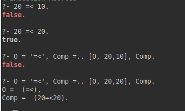

# Train Network Assignment FAQ

- [Train Network Assignment FAQ](#train-network-assignment-faq)
    - [What is the stop-over type if there are other train types? What are the terms for the train type atoms that we should consider?](#what-is-the-stop-over-type-if-there-are-other-train-types-what-are-the-terms-for-the-train-type-atoms-that-we-should-consider)
    - [If a stop-over is 0, does it mean the train cannot stop at that station at all?](#if-a-stop-over-is-0-does-it-mean-the-train-cannot-stop-at-that-station-at-all)
    - [For `fastest_route/6`, can we assume there is only 1 fastest route?](#for-fastest_route6-can-we-assume-there-is-only-1-fastest-route)
    - [Can we take that `bounded_route/7` holds if `Duration` is _less-or-equal_ than `Limit`?](#can-we-take-that-bounded_route7-holds-if-duration-is-less-or-equal-than-limit)
    - [How can I compute & carry "so-far" results?](#how-can-i-compute--carry-so-far-results)

### What is the stop-over type if there are other train types? What are the terms for the train type atoms that we should consider?

Fair point. The predicate `city/3` only records the stop-over time for two types of train: `freight` and `passenger`. There will be no query testing other type of trains. For accounting for other train types we need a better, more general, representation of stop-over times, not just hard-coded in `city/3`.

Also, you should only consider two atom train types for the assignment: `freight` and `passenger`. Do not use other atoms, like `'Freight'` or `'FREIGHT'`.

### If a stop-over is 0, does it mean the train cannot stop at that station at all?

No, the stop-over is the time stopping there _on the way to another destination_. If it has 0, it means there is no stop-over time there. However, the train can have that as the actual destination (or origin). That is why we don't account for stop-overs at the two endpoints.

### For `fastest_route/6`, can we assume there is only 1 fastest route?

Yes and no. There could indeed be more than one fastest route because they are equally fast. An implementation that yields all fastest routes is of course better than those that return just one.

You may need a more "general" `bounded_route/7` though, check next question...

### Can we take that `bounded_route/7` holds if `Duration` is _less-or-equal_ than `Limit`?

Not really, the spec is clear in saying it must return paths that are less than the threshold duration, not less-or-equal. :-)

Said so, nothing precludes you to write a more general predicate (that `bounded_route/7` relies on) that does both, as needed: _less_ OR _less-or-equal_. You can configure what you need via a parameter. 

And if you want to go very sophisticated and meta-programming you can use that parameter to pass what kind of operation you should use!. Check this "hint":



:-)

### How can I compute & carry "so-far" results?

A usual strategy for computing something is to carry intermediate results until the end, and once there, just equate the final result with the result so far.

For example, this is how I can sum a list of numbers:

```prolog
sumar(L, R) :- sumar(L, 0, R).

sumar([], SumSoFar, SumSoFar).
sumar([X|L], SumSoFar, Result) :-
    SumSoFar2 is  SumSoFar + X,
    sumar(L, SumSoFar2, Result).
```

Check a run:

```prolog
?- sumar([1,2,3,4], R).
R = 10.
```

